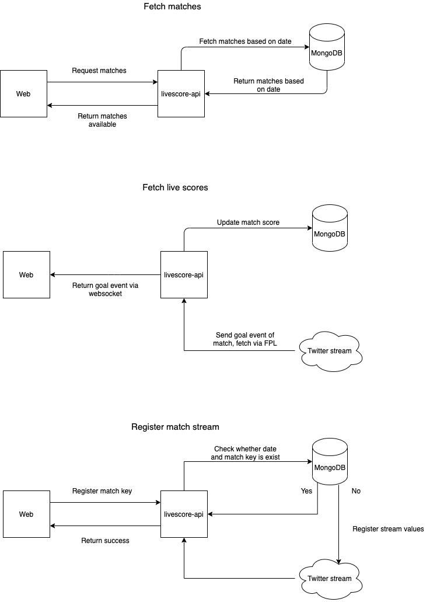

# Gunners

A livescore API utilize Twitter stream API.

## Main Services

### `TwitterService`

TwitterService will responsible to be layer that abstract Twitter API functionalities, especially for stream API. Functionalities in this service includes `SetRules`, `GetRules` and `Stream`. Set rules is for managing keywords, tweets from a specific twitter account or any rules to listen or stream tweets from Twitter API. In this project, this layer will store rules for matches hastags and specify account handler that are going to be source of tweets. `Stream` will be method that allowing this API to stream tweets from Twitter API based on rules that we specify on `SetRules` functionalities. Stream will always opened and will utilize Golang concurrency to keep HTTP connection open to Twitter API.

### `WebsocketService`

WebsocketService will responsible to be layer that sending data into websocket connection. This service, will range over `TwitterChan` channel. If there are messages coming from `TwitterChan` channel, service will proxying data into opened websocket connection, which is in this case is livescore web client.

### API Design

## TODO

- Adding backoff implementation if Twitter API hit rate limit.

In case you guys have any feedbacks, please don't hesitate to raise issues. Thank you.
